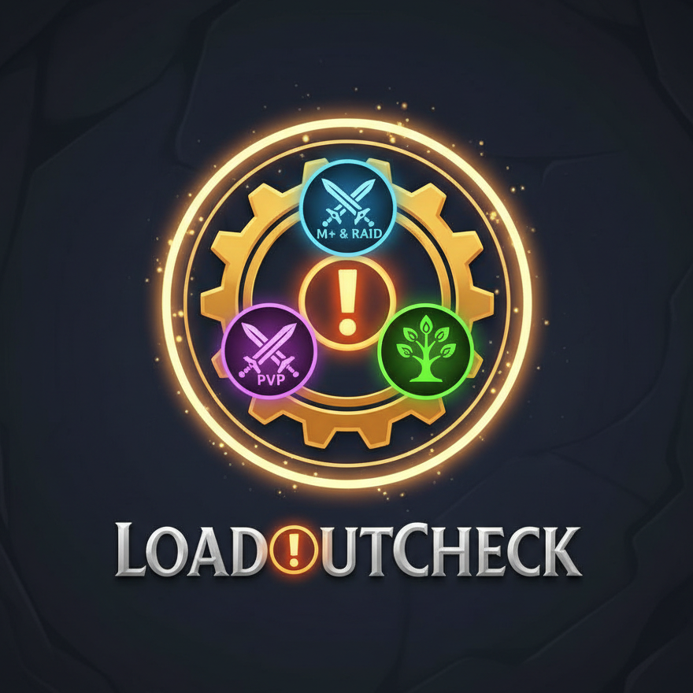

# Loadout Checker

**Loadout Checker** is a lightweight utility designed to prevent that "oops" moment when you pull a boss with your Mythic+ talents still active in a raid.

## Features

- **Automatic Validation:** Checks your talent loadout the moment a **Ready Check** goes out.
- **Context Awareness:** Knows whether you're in a Dungeon (M+), Raid, PvP (Arenas & Battlegrounds) or a Delve. Still in town when the ready check goes out? It uses your group type to guess: raid group means raid, party means dungeon.
- **Visual & Audio Alerts:** A warning sound, a popup, and a flashing micro menu (as seen in the screenshots) when your loadout doesn't match.
- **One-Click Switch:** If you have a saved loadout that matches (e.g. "Raid ST"), the popup offers to switch to it for you.
- **Works Out of the Box:** Just name your loadouts. No setup required.
- **Customizable:** Use your own keywords, turn off any content type, and choose which alerts you want.

## How to use

Loadout Checker looks at the name of your active loadout for a keyword. By default:

| Content | Your loadout name should contain |
|---|---|
| Dungeons / M+ | **m+** |
| Raids | **raid** |
| PvP (Arena & BGs) | **pvp** |
| Delves | **delve** |

Matching ignores upper and lower case, so "Raid ST", "M+ AoE" and "pvp - arena" all work.

If a mismatch is found, a popup appears and your micro menu flashes until you close the popup, change talents, or enter combat. If one of your saved loadouts for your current spec matches, the popup has a **Switch** button that loads it for you. Talents can only be changed out of combat, and not during a boss fight or once a Mythic+ key has started.

## Settings

Open the settings with **/lc** (or **Options → AddOns → Loadout Checker**).

- **Custom keywords:** Name your builds differently? Add your own keywords, separated by commas. For example, `m+, keys, mythic` for dungeons means any loadout name containing one of those words counts.
- **Turn content types on or off:** For example, turn off Delves if you don't care about them.
- **Choose your alerts:** Turn the sound, popup, flash and chat messages on or off individually.

## Commands

- `/lc` or `/loadoutchecker`: open the settings
- `/lc check`: run a check right now, no ready check needed

## Feedback

Found a bug or have an idea? [Open an issue on GitHub](https://github.com/derekjj/LoadoutChecker/issues).

## License

[MIT](LICENSE) © Derek Johnston (Bigbranch). Feel free to use, fork and modify it; just keep the credit.
